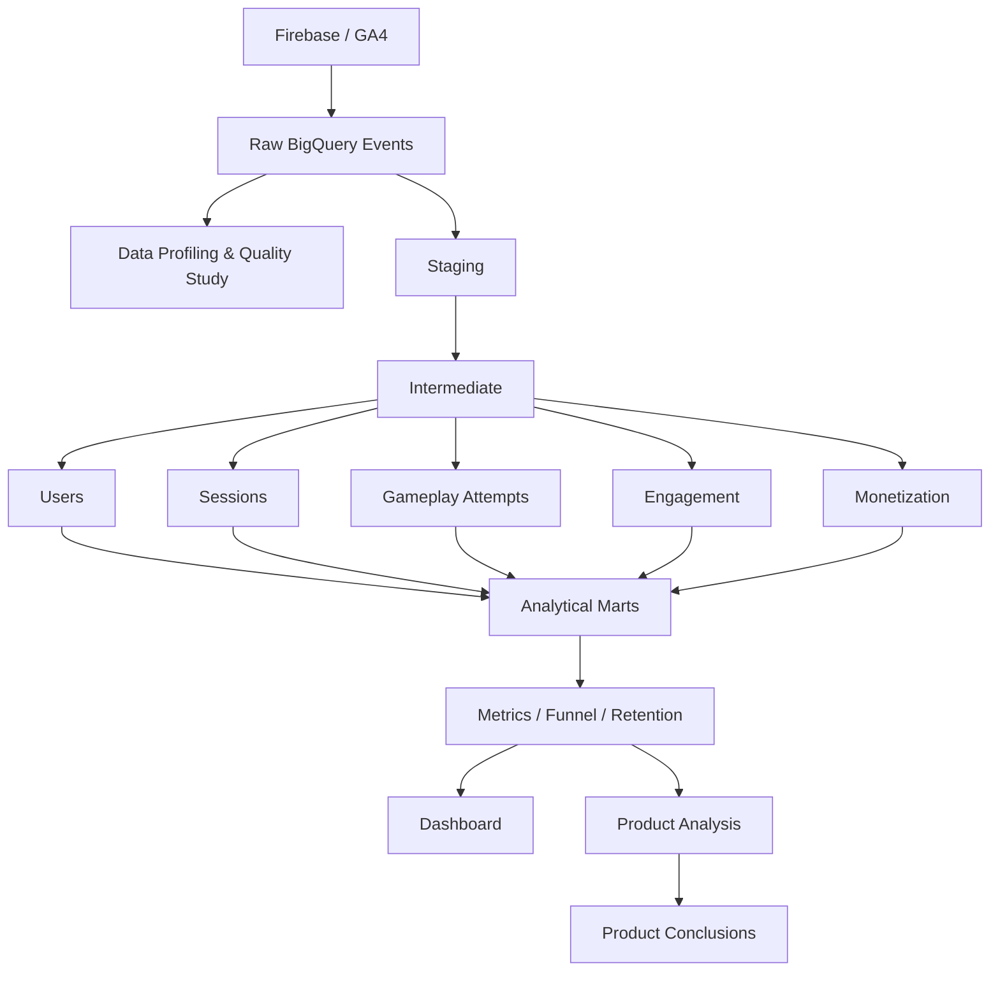

# Flood-It! Product Analytics


Проект посвящен исследованию пользовательского поведения в мобильной игре **Flood-It!** на основе event-level данных из Firebase / Google Analytics.

**Flood-It!** — мобильная puzzle-игра, в которой пользователю необходимо постепенно закрасить игровое поле одним цветом за ограниченное число ходов.

## Цель исследования:

> Понять, на каком этапе Flood-It! теряет новых пользователей. 

> Дать рекомендации: какое продуктовое изменение потенциально может увеличить D1 retention и, как следствие, прибыль компании.

## Business problem

> Пользователи не возвращаются в игру после первого игрового опыта, закрывая возможность реализации всех уровней монетизации за счет платных опций и рекламных интеграций.

Анализируемый путь:

```text
Первое использование
        ↓
Первая игра
        ↓
Первый результат
        ↓
Продолжение / Retry / Выход
        ↓
Активность первого дня
        ↓
D1 / D7 retention
```
## Metrics

**North Star:** D1 retention.

Дополнительные метрики:

- activation rate;
- continuation rate;
- retry rate;
- first-session result depth;
- first-session attempt depth;
- same-day return;
- D7 retention;
- IAP conversion.

## Результат:

> Установлено, что D1 retention может быть увеличен путем влияния на переход пользователя **от первого полученного результата к следующей попытке**. У активированных пользователей retention первого дня составил **34,1% против 15,2%** среди пользователей, прекративших игру после первого результата.

## Product recommendation

Рассматриваемый этап пользовательского пути: `первый результат → следующее игровое действие`

Рекомендация — упростить **post-game continuation flow**:

- Упростить переход к следующему уровню после победы через дополнительное выделение кнопки "Next Level"
- Визуально выделить кнопку "Retry", делая ее более заметной для пользователя.
- Убрать промежуточные экраны, чтобы пользователь не возвращался в меню, а сразу переходил к следующей попытке.
- Добавить явное отображение прогресса для повышения прозрачности пользовательского пути и появления мотивации
- Добавить награды за пройденные уровни
- Добавить подсказки на раннем fail, чтобы снизить отток в случае неудачи.

## Dataset

Источник в Google BigQuery: `firebase-public-project.analytics_153293282.events_*`

| Характеристика | Значение |
|---|---:|
| Период наблюдения | 12.06.2018 — 03.10.2018 |
| Daily tables | 114 |
| События | 5 700 000 |
| Пользователи | 15 175 |
| Пользователи с first touch внутри периода | 6 089 |

## Analytical conclusions

### 1. Начало новой игровой попытки после первой игры связано с D1 сильнее, чем c результатом первой игры.

После первого результата **46,7% пользователей продолжают gameplay**.

| Сегмент | D1 retention |
|---|---:|
| Activated | **34,1%** |
| Not activated | **15,2%** |
| Разница | **+18,9 п.п.** |

У активированных пользователей наблюдаемый D1 примерно в **2,2 раза выше**.

### 2. Победа в первой игре значимо не влияет на Retention D1

| Первый результат | D1 retention |
|---|---:|
| Success | **24,6%** |
| Fail | **22,9%** |

Разница — **1,7 п.п.**

### 3. Вовлеченность пользователя в первую игровую сессию связана с retention нелинейно

| Результативных игр в первой сессии | D1 retention |
|---|---:|
| 1 | 14,7% |
| 2 | 22,9% |
| 3–4 | 31,8% |
| 5+ | 35,6% |

Основной прирост наблюдается между ранним выходом и несколькими результативными игровыми взаимодействиями. После этого эффект постепенно насыщается.

### 4. Same-day return — сильный сигнал вовлечённости

| Сегмент | D1 retention |
|---|---:|
| Same-day return | **41,7%** |
| Без same-day return | **19,0%** |

Разница — **+22,7 п.п.**

### 5. Retry после поражения связан с более высоким D1

| После первого fail | D1 retention |
|---|---:|
| Retry | **30,4%** |
| Без retry | **16,8%** |

Post-fail experience становится отдельной потенциальной точкой роста, которая отражает вовлеченность пользователя.

## Dashboard

- D1 / D7 retention;
- activation rate;
- continuation rate;
- retry rate;
- first-session result depth;
- same-day return;
- retention по behavioural segments;
- first-result outcome;
- exploratory monetization metrics.


**Материалы dashboard:** [`dashboard/`](dashboard/)

## Data architecture


``` text
Airflow
   └── orchestrates
       Staging → Intermediate → Marts → Dashboard

Monitoring
   └── checks
       source + pipeline + data quality + product metrics

```
## Technical stack

| Задача | Инструмент |
|---|---|
| Источник событий | Firebase / GA4 |
| Хранилище | Google BigQuery |
| Data profiling | SQL |
| Трансформации | SQL |
| Анализ данных | Python, pandas |
| Статистический анализ | SciPy / statsmodels |
| Визуализация | BI, matplotlib |
| Orchestration | Apache Airflow |
| Version control | Git / GitHub |
| Документация | Markdown |

## Repository

```text
├── airflow/               # orchestration
├── dashboard/             # dashboard и screenshots
├── docs/                  # документация и Data Quality
├── notebooks/             # исследовательский анализ
├── sql/
│   ├── profiling/         # profiling / DQ
│   ├── staging/           # очистка и нормализация
│   ├── intermediate/      # users / sessions / attempts
│   └── marts/             # продуктовые витрины
├── tests/                 # проверки данных
├── requirements.txt
└── README.md
```
## Limitations

Dataset является публичной обфусцированной выборкой и не гарантирует полную пользовательскую историю: каждая daily table содержит ровно 50 000 событий, поэтому raw event volume не интерпретируется как реальная динамика трафика.

Sessions и gameplay attempts реконструируются из наблюдаемых событий. D1/D7 retention рассчитывается только для когорт с полным доступным observation window.

В данных всего мало сведений о покупках, поэтому monetization findings носят исследовательский характер. Анализ показал наличие связи с рассматриваемыми характеристиками, но не позволяет судить о причинности в силу ограниченности.