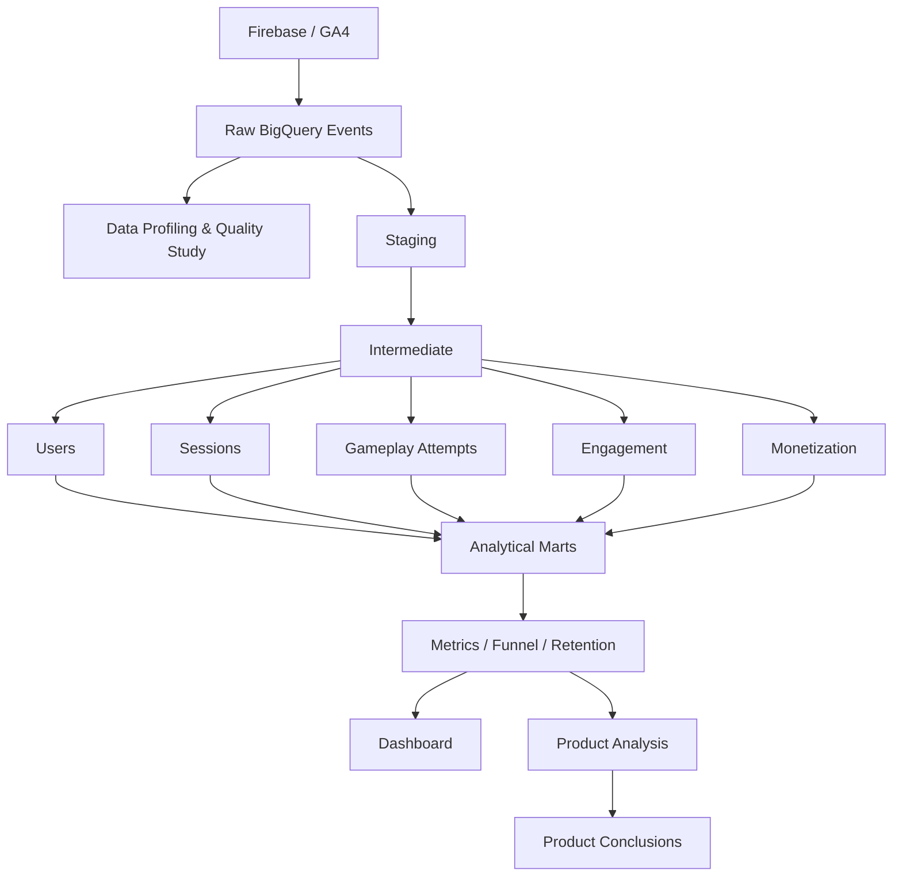

# Flood-It! Product Analytics


Проект посвящен исследованию пользовательского поведения в мобильной игре **Flood-It!** на основе event-level данных из Firebase / Google Analytics.

**Flood-It!** — мобильная puzzle-игра, в которой пользователю необходимо постепенно закрасить игровое поле одним цветом за ограниченное число ходов.

## Цель исследования:

> Понять, на каком этапе Flood-It! теряет новых пользователей. 

> Дать рекомендации: какое продуктовое изменение потенциально может увеличить D1 retention и, как следствие, прибыль компании.

## Business problem

> Пользователи не возвращаются в игру после первого игрового опыта, закрывая возможность реализации всех уровней монетизации за счет платных опций и рекламных интеграций.

Анализируемый путь:

```text
Первое использование
        ↓
Первая игра
        ↓
Первый результат
        ↓
Продолжение / Retry / Выход
        ↓
Активность первого дня
        ↓
D1 / D7 retention
```
## Metrics

**North Star:** D1 retention.

Дополнительные метрики:

- activation rate;
- retry rate;
- first-session result depth;
- same-day return;
- D7 retention;
- IAP conversion.

## Результат:

> Установлено, что D1 retention может быть увеличен путем влияния на переход пользователя **от первого полученного результата к следующей попытке**. У активированных пользователей retention первого дня составил **28,67% против 19,57%** среди пользователей, прекративших игру после первого результата.

## Product recommendation

Рассматриваемый этап пользовательского пути: `первый результат → следующее игровое действие`

Рекомендация — упростить **post-game continuation flow**:

- Упростить переход к следующему уровню после победы через дополнительное выделение кнопки "Next Level"
- Визуально выделить кнопку "Retry", делая ее более заметной для пользователя.
- Добавить подсказки при прохождении первой игры, чтобы повысить число пользователей, которые успешно ее завершили и продолжили взаимодействие с игрой.
- Убрать промежуточные экраны, чтобы пользователь не возвращался в меню, а сразу переходил к следующей попытке.
- Добавить явное отображение прогресса для повышения прозрачности пользовательского пути и появления мотивации
- Добавить награды за пройденные уровни
- Добавить подсказки на раннем fail, чтобы снизить отток в случае неудачи.

## Dataset

Источник в Google BigQuery: `firebase-public-project.analytics_153293282.events_*`

| Характеристика | Значение |
|---|---:|
| Период наблюдения | 12.06.2018 — 03.10.2018 |
| Daily tables | 114 |
| События | 5 700 000 |
| Пользователи | 15 175 |
| Пользователи с first touch внутри периода | 6 068 |

## Analytical conclusions

В финальную new-user cohort вошло **6 068 пользователей**.

Базовый D1 retention составил **20,67%**, D7 retention — **6,16%**.

### 1. Если пользователь после первой результативной игры начинает новую, то вероятность возвращения D1 retention возрастает.

Среди пользователей с наблюдаемым первым результатом activation определяется как начало следующей игровой попытки в рамках той же аналитической сессии.

| Сегмент | D1 retention |
|---|---:|
| Activated | **28,67%** |
| Not activated | **19,57%** |
| Разница | **+9,09 п.п.** |

95% CI абсолютной разницы: **[5,79; 12,17] п.п.**

Наблюдаемый D1 у activated users примерно в **1,46 раза выше**.

Связь статистически значима, влияние сохраняется и при деление на сегменты по платформе и не является случайным наблюдением.

### 2. Результат первой игры связан с вероятностью дальнейшего продолжения

| Первый результат | Activation rate |
|---|---:|
| Success | **82,26%** |
| Fail | **75,14%** |
| Разница | **+7,12 п.п.** |

95% CI разницы: **[4,50; 9,76] п.п.**

Пользователи успешно завершившие первую игру значимо чаще продолжают игровую сессию. Однако среди пользователей, чей первый наблюдаемый результат — `fail`, 69,31% начинают повторную попытку того же уровня, что не позволяет однозначно заключить, насколько сложна и интересна для пользователей игра.

### 3. First session depth связана с D1

Число сыгранных пользователем результативных игр в течение первой сессии связано с вероятностью возвращения пользователя в D1.

Spline logistic regression показывает значимое улучшение относительно модели без `first_session_depth`:

- likelihood-ratio statistic = **13,64**;
- p-value = **0,0034**.

Непараметрическое сравнение также показало значимое различие, размер эффекта при этом небольшой, поэтому внедрение изменений на основе этой метрики будет зависеть от оценки рисков и стратегии компании. 

### 4. Same-day return связан с существенно более высоким D1 retention

| Сегмент | D1 retention |
|---|---:|
| Same-day return | **23,36%** |
| Без same-day return | **14,93%** |
| Разница | **+8,43 п.п.** |

95% CI абсолютной разницы: **[6,34; 10,45] п.п.**

Пользователи, возвращающиеся в отдельную сессию в день первого использования, имеют наблюдаемый D1 примерно в **1,57 раза выше**, что делает метрику удобным инструментом отслеживания результатов стратегии по повышению D1 Retention.

### 5. Связь early engagement с IAP статистически не подтверждена

Анализ ограничен объемом выборки, во всей когорте покупку совершили всего 22 пользователя.

Наблюдаемые IAP rates выше среди более вовлечённых пользователей:

- activated: **0,521%** против **0,125%** среди non-activated;
- same-day return: **0,434%** против **0,208%** без same-day return.

Однако статистически значимой связи между рассмотренными признаками и фактом совершения IAP обнаружено не было, факт обусловлен малым объемом выборки, который не обеспечивает необходимую чувствительность тестам, это также подтверждают широкие доверительные интервалы, в связи с чем нельзя делать выводы о влиянии признаков ранней вовлеченности на наступление события IAP. 

- Для `first_session_depth` не обнаружено свидетельств того, что пользователи с IAP систематически имеют более высокую глубину первой сессии.

### 6. Ограничение дополнительных ходов связано прежде всего с rewarded-рекламой

Столкновение пользователя с ограничением доступных дополнительных ходов связано с последующим использованием rewarded-рекламы и покупкой пакетов `extra_steps`.

Событие `no_more_extra_steps` связано с резко большей наблюдаемой частотой rewarded ads:

| Сегмент | Rewarded ad rate |
|---|---:|
| Есть `no_more_extra_steps` | **19,56%** |
| Нет `no_more_extra_steps` | **0,23%** |

Покупка дополнительных ходов наблюдается чаще среди пользователей с `no_more_extra_steps`:

| Сегмент | Extra steps purchase rate |
|---|---:|
| Есть `no_more_extra_steps` | **0,365%** |
| Нет `no_more_extra_steps` | **0,038%** |

При этом пакеты `extra_steps` приобрели только **5 пользователей**, поэтому величина связи с покупкой оценивается с высокой неопределённостью.

## Dashboard


**Материалы dashboard:** [`dashboard/`](dashboard/)

## Data architecture


``` text
Airflow
   └── orchestrates
       Staging → Intermediate → Marts → Dashboard

Monitoring
   └── checks
       source + pipeline + data quality + product metrics

```
## Technical stack

| Задача | Инструмент |
|---|---|
| Источник событий | Firebase / GA4 |
| Хранилище | Google BigQuery |
| Data profiling | SQL |
| Трансформации | SQL |
| Анализ данных | Python, pandas |
| Статистический анализ | SciPy / statsmodels |
| Визуализация | BI, matplotlib |
| Orchestration | Apache Airflow |
| Version control | Git / GitHub |
| Документация | Markdown |

## Repository

```text
├── airflow/               # orchestration
├── dashboard/             # dashboard и screenshots
├── docs/                  # документация и Data Quality
├── notebooks/             # исследовательский анализ
├── sql/
│   ├── profiling/         # profiling / DQ
│   ├── staging/           # очистка и нормализация
│   ├── intermediate/      # users / sessions / attempts
│   └── marts/             # продуктовые витрины
├── tests/                 # проверки данных
├── requirements.txt
└── README.md
```
## Limitations

Dataset является публичной обфусцированной выборкой и не гарантирует полную пользовательскую историю: каждая daily table содержит ровно 50 000 событий, поэтому raw event volume не интерпретируется как реальная динамика трафика.

Sessions и gameplay attempts реконструируются из наблюдаемых событий. D1/D7 retention рассчитывается только для когорт с полным доступным observation window.

В данных всего мало сведений о покупках, поэтому monetization findings носят исследовательский характер. Анализ показал наличие связи с  некоторыми из рассматриваемых характеристик, но не позволяет судить о причинности в силу ограниченности.